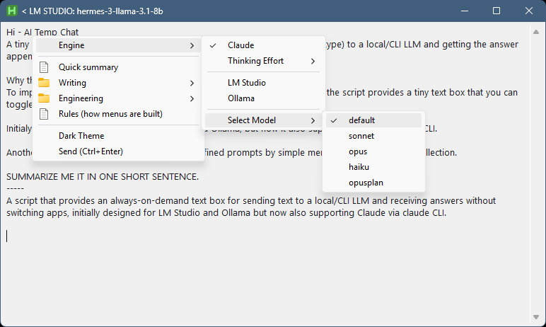
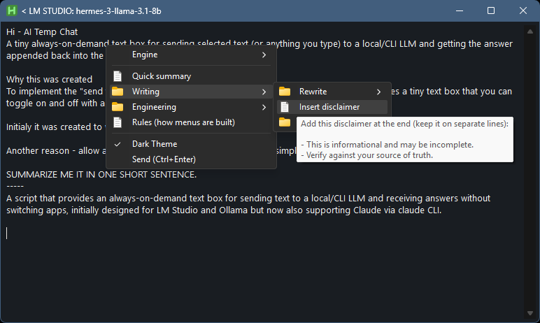

# Hi - AI Temp Chat

A tiny always-on-demand text box for sending selected text (or anything you type) to a local/CLI LLM and getting the answer appended back into the same box.

## Why this was created

To implement the "send text -> get answer" workflow without switching apps, the script provides a tiny text box that you can toggle on and off with a hotkey. 

Initialy it was created to work with **LM Studio** and **Ollama**, but now it also supports **Claude CLI**.

Another reason - allow applying different predefined prompts by simple menu selection from your collection.

## Install / Run

No installer - just run the app. If absent, it will create a starter `prompts.md` file.

## How to use

- To toggle the window - press Win+Alt+A hotkey. 
- To send the text - press Ctrl+Enter.
- To close the window - press Esc (or window close button; it hides to tray).

When the app opens, it automatically copies any selected text or object in your current window into the text box, so you can instantly discuss it with the engine.

Right-click inside the text box and you will get the context menu:
  - Engine selection (Claude / LM Studio / Ollama)
  - Thinking Effort (for Claude only)
  - Select Model
  - Prompts menu created from `prompts.md` 
  - Dark Theme

When you send text to the engine, the script inserts a divider line and appends the model response below it. The response is also automatically copied to the clipboard for easy pasting.

## prompts.md rules

The prompts menu is built from `prompts.md` in the same folder as the script.

This file must be prepared according to the following rules:
- Headings define menu structure.
- Any heading levels is allowed.
- A heading becomes a submenu only if the next non-empty line is a heading with exactly one more `#`.
  - Example: `## Title` becomes a submenu if the next heading is `### Something`.
- Otherwise, a heading becomes a clickable item.
- The prompt text is everything under that heading until the next heading.
- Hover a clickable prompt item to see a tooltip preview (after a short delay).

If `prompts.md` does not exist, the script creates it with a starter template.

## Privacy

This script does not collect telemetry and does not send data anywhere except to the selected engine (Claude CLI, LM Studio, or Ollama). What happens to your text depends on the engine you select (Claude CLI, LM Studio, or Ollama). If you don’t trust it, review the source code in this repository.

## License

GPL-3.0-or-later.
